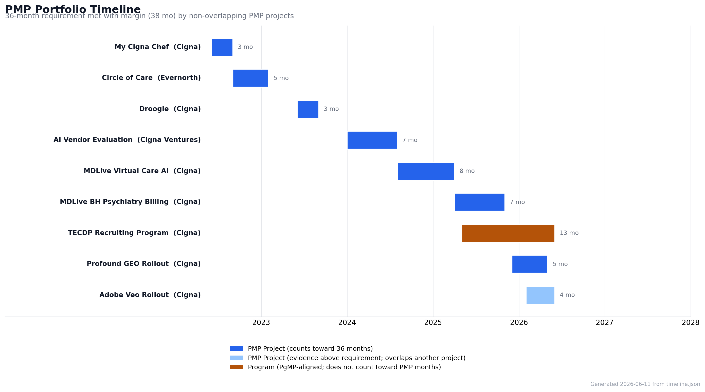

# PMP Project Management Portfolio

This repository documents my project management experience as part of my application for the **Project Management Professional (PMP)** certification through PMI. Each project entry maps to PMBOK 7th Edition terminology and the 2021 PMP Examination Content Outline.

---

## Background

I have a 4-year degree, so PMI requires 36 non-overlapping months of project leadership experience within the last 8 years. The eight individual projects in the PMP portfolio below get me there across healthcare, clinical AI, AI governance, and marketing technology, spanning roles from Project Manager and Product Owner to technical and project lead.

Each project file has everything PMI wants to see: the standard application fields, process group and knowledge area coverage, a stakeholder map, a risk register, tools used, lessons learned, and a narrative written for the application itself. Every entry documents a single, discrete project from initiation through closing, as PMI requires.

A separate **[Program Portfolio](#program-portfolio)** documents program-level work. That experience aligns to program management (PgMP) rather than PMP, so it is kept separate and does **not** count toward the PMP project-month total.

---

## PMP Experience Summary

| # | Project | Organization | Role | Methodology | Dates | Months |
|---|---|---|---|---|---|---|
| 1 | [My Cigna Chef — Healthy Eating Rewards App](/Projects/2022_06_cigna-my-cigna-chef.md) | Cigna | Project Manager | Agile / Scrum | 06/2022 – 08/2022 | 3 |
| 2 | [Circle of Care — Healthcare Blockchain Platform](/Projects/2022_09_evernorth-circle-of-care-blockchain.md) | Evernorth Health Services | Technical Workstream Lead | Agile / Scrum | 09/2022 – 01/2023 | 5 |
| 3 | [Droogle — Drug Research & Contracting Intelligence](/Projects/2023_06_cigna-droogle-drug-research-platform.md) | Cigna | Product Owner | Agile / Scrum | 06/2023 – 08/2023 | 3 |
| 4 | [AI Vendor Evaluation Program — Cigna Ventures](/Projects/2024_01_cigna-ventures-vendor-vetting.md) | Cigna / Cigna Ventures | Technical Due Diligence Lead | Structured Evaluation | 01/2024 – 07/2024 | 7 |
| 5 | [MDLive Virtual Care AI Automation](/Projects/2024_08_cigna-mdlive-virtual-care-ai-automation.md) | Cigna | Technical Project Lead | Hybrid Agile / Compliance-Gated | 08/2024 – 03/2025 | 8 |
| 6 | [MDLive BH Psychiatry Billing Categorization](/Projects/2025_04_cigna-mdlive-bh-psychiatry-billing.md) | Cigna | Engineering Project Management Lead | Hybrid POC / Compliance-Gated | 04/2025 – 10/2025 | 7 |
| 7 | [Profound GEO — Vendor Solution Rollout](/Projects/2025_12_cigna-profound-geo-rollout.md) | Cigna | IT Project Manager | Hybrid Stage-Gated | 12/2025 – 04/2026 | 5 |
| 8 | [Adobe Veo — Generative AI Enablement Rollout](/Projects/2026_02_cigna-adobe-veo-rollout.md) | Cigna | IT Project Manager | Hybrid Stage-Gated | 02/2026 – 05/2026 | 4* |
| | | | | | **Non-overlapping total** | **38** |

\* Adobe Veo (02/2026 – 05/2026) overlaps the Profound rollout in Feb–Apr 2026. PMI counts overlapping calendar time once, so Veo is documented as additional evidence above the 38-month base rather than as additive months. The non-overlapping total of 38 months is met by projects 1–7, clearing the 36-month requirement with margin.

---

## Project Timeline

*The 36-month requirement is met with margin by non-overlapping projects 1–7 (38 months). All experience falls within the 8-year PMI eligibility window.*

> **Note:** `timeline.png` still reflects the prior portfolio structure and should be regenerated to match the eight projects above.

---

## Domain and Methodology Coverage

| | Healthcare IT | Healthcare Analytics | Healthcare Data | Clinical AI | AI Governance / Vendor | Marketing AI |
|---|---|---|---|---|---|---|
| **Agile / Scrum** | My Cigna Chef | Droogle | Circle of Care | | | |
| **Hybrid / Compliance-Gated** | | | | MDLive Virtual Care · BH Billing | | |
| **Structured Evaluation** | | | | | Vendor Vetting | |
| **Hybrid Stage-Gated** | | | | | Profound | Adobe Veo |

---

## PMI Process Group Coverage

All five PMBOK process groups are represented in every PMP project entry.

| Process Group | Coverage |
|---|---|
| Initiating (IN) | All 8 projects |
| Planning (PL) | All 8 projects |
| Executing (EX) | All 8 projects |
| Monitoring & Controlling (MC) | All 8 projects |
| Closing (CL) | All 8 projects |

---

## Projects

### 1. My Cigna Chef
**[View full project file](/Projects/2022_06_cigna-my-cigna-chef.md)**

| Field | Detail |
|---|---|
| Organization | Cigna |
| Role | Project Manager |
| Dates | 06/2022 – 08/2022 |
| Budget | Nominal (internal tools / AWS via approval) |
| Team Size | 11 |
| Methodology | Agile / Scrum, 3 sprints |

Part of Cigna's Summer Innovation Program. The ask was to find a way to encourage healthier eating in insured populations. Our team of 11 interns built a recipe sharing app that let users set personal health goals, earn points for hitting them, and apply those points toward lower premiums. I ran the project: organized the team into workstreams, set up our Agile ceremonies, managed the backlog, and led the final presentation to Cigna executives.

The tricky part was defining what "healthy" actually meant for a diverse user base. We solved it by letting users define their own goals and building pre-approved reward tracks around those, rather than forcing a one-size-fits-all approach.

**Outcome:** Shipped a working full-stack app with Okta auth, a payment processor integration, and a custom REST API in 11 weeks.

---

### 2. Circle of Care
**[View full project file](/Projects/2022_09_evernorth-circle-of-care-blockchain.md)**

| Field | Detail |
|---|---|
| Organization | Evernorth Health Services |
| Role | Technical Workstream Lead |
| Dates | 09/2022 – 01/2023 |
| Budget | Nominal (internal infrastructure) |
| Team Size | ~4 |
| Methodology | Agile / Scrum |

A blockchain platform that gave patients control over who could see their health records and for how long. The idea was simple: you grant a provider access, they get a window to view your consolidated record, and when that window closes, so does their access automatically. No persistent exposure, no manual revocation required.

I led the blockchain workstream, which meant owning the architecture and the implementation. I designed the smart contract logic that handled the full access lifecycle: grant, active, expired, revoked. Business requirements came from senior leads; how we built it was mine to figure out.

**Outcome:** A working POC privacy-by-design health data exchange platform, built to Evernorth's enterprise architecture standards.

---

### 3. Droogle
**[View full project file](/Projects/2023_06_cigna-droogle-drug-research-platform.md)**

| Field | Detail |
|---|---|
| Organization | Cigna |
| Role | Product Owner |
| Dates | 06/2023 – 08/2023 |
| Budget | Nominal (internal tools / AWS via approval) |
| Team Size | ~10 |
| Methodology | Agile / Scrum, 3 sprints |

Cigna's contracting teams negotiate with drug manufacturers, and they were going in without great visibility into what competitors were paying. Droogle was a drug research and discovery platform that pulled public pricing data, modeled competitor discounts for biosimilars, and surfaced it all in a dashboard so our teams had real leverage at the table.

As Product Owner, my job was to stay close to the contracting stakeholders, understand what they actually needed (not just what they asked for), and make sure the dev team was building toward that. One of the bigger challenges was data: early on we realized the public sources we planned to use were not as clean or accessible as expected. Catching that early and resetting expectations before we were deep in build saved us significant rework.

**Outcome:** Won our prompt category at the 2023 TECDP Summer Innovation Presentations. Our application was used as the basis for a current solution which is running in production environments today.

---

### 4. AI Vendor Evaluation Program
**[View full project file](/Projects/2024_01_cigna-ventures-vendor-vetting.md)**

| Field | Detail |
|---|---|
| Organization | Cigna / Cigna Ventures |
| Role | Technical Due Diligence Lead |
| Dates | 01/2024 – 07/2024 |
| Budget | N/A (supported Ventures investment decisions) |
| Team Size | 3 |
| Methodology | Structured multi-gate evaluation framework |

Cigna Ventures was evaluating AI vendors for potential investment or partnership, and they needed someone who could actually stand the products up and test them, not just sit through demos. I was that person. For each vendor, I would deploy their product in our environment, run it against real scenarios, review their data handling and security practices, and assess whether what they claimed matched what the product actually did.

A fair number did not hold up. That was the point of the work.

**Outcome:** Delivered technical assessments with clear go/no-go recommendations, grounded in evidence rather than vendor pitch decks.

---

### 5. MDLive Virtual Care AI Automation
**[View full project file](/Projects/2024_08_cigna-mdlive-virtual-care-ai-automation.md)**

| Field | Detail |
|---|---|
| Organization | Cigna |
| Role | Technical Project Lead / Lead Developer |
| Dates | 08/2024 – 03/2025 |
| Budget | $500K – $1M (estimated) |
| Team Size | 4 |
| Methodology | Hybrid Agile / Compliance-Gated |

This one started with an investor call. Cigna's CIO referenced MDLive as having AI-powered SOAP note generation and automated physician quality review. The problem: it did not. What existed was a basic NLP transcription tool that produced summaries. I was brought in to build what had been described, fast.

I started as the sole developer, scoping the architecture and building the initial system from the ground up: a dynamic prompt pipeline that pulled in patient context (demographics, history, visit type), structured clinical SOAP notes, and automated quality review flags that checked for things like allergy screenings and pregnancy questions based on patient profile. Everything was built with human-in-the-loop compliance requirements and documented escalation paths for when the model got something wrong.

Once we hit MVP, two HIH engineers joined and we set up a proper Dev/Prod pipeline where I built and tested on the dev side and they handled production deployments after automated validation. We ran through four model generations (GPT-3.5, 4, 4o, o1) without any prolonged production outages. I eventually transitioned the system to a permanent HIH team in Hyderabad and spent six months advising during handoff.

**Outcomes:**
- 400+ physicians onboarded; now the default workflow for all MDLive consults
- 10,000+ consults processed in the first year
- Replaced a quarterly manual review process (200+ transcripts, low accuracy, expensive licensed resource time)
- Estimated **$600,000+ in business savings**
- Zero production incidents across four LLM generations

---

### 6. MDLive BH Psychiatry Billing Categorization
**[View full project file](/Projects/2025_04_cigna-mdlive-bh-psychiatry-billing.md)**

| Field | Detail |
|---|---|
| Organization | Cigna |
| Role | Engineering Project Management Lead |
| Dates | 04/2025 – 10/2025 |
| Budget | Internal labor / AI gateway consumption |
| Team Size | 3 |
| Methodology | Hybrid POC / Compliance-Gated |

MDLive behavioral health psychiatry consults were being billed through a manual coding process. Correct billing under Medical Decision Making (MDM) standards depends on factors like the complexity of the patient's history and the time spent in the consult, and getting it wrong creates compliance and revenue risk. The objective was a system that could categorize a consult to the correct MDM-based billing level automatically.

The defining constraint was that the system could not use the consult transcript. It had to reach the right billing category from metadata alone, specifically the patient's prior history and the time spent in the meeting. I led a team of three to prove the approach as a POC, validated its output against known-correct billing categories with the billing function, and then rolled it out to physicians. Because the system lived on the backend rather than a physician-facing surface, the rollout was clean and low-risk.

**Outcome:** Delivered and rolled out a validated backend categorization system that automated MDM-based billing categorization from history and consult duration alone, with risks inventoried and stakeholder sign-off before go-live.

---

### 7. Profound GEO — Vendor Solution Rollout
**[View full project file](/Projects/2025_12_cigna-profound-geo-rollout.md)**

| Field | Detail |
|---|---|
| Organization | Cigna |
| Role | IT Project Manager |
| Dates | 12/2025 – 04/2026 |
| Budget | Vendor contract + internal labor |
| Team Size | Cross-functional core team + vendor & review functions |
| Methodology | Hybrid Stage-Gated |

Profound is a Generative Engine Optimization (GEO) tool, effectively SEO for generative AI platforms, optimizing how Cigna's web content is surfaced and represented by LLM-based systems. The objective was to take the vendor solution from approved-for-evaluation through to a compliant production deployment on Cigna's websites.

By the time the project reached me it had cleared initial legal, architecture, and information security approval. I led it through the rest: kicked off the team, charted a roadmap to comply with enterprise standards, and scheduled demo sessions with approvers to pass architecture and guardrail review. Much of the work was vendor-facing, eliciting the system information enterprise review needed out of Profound. I worked with legal to put the correct contracting addendums in place, defined the human approval roles and responsibilities for changes to key infrastructure, supported testing, and re-engaged the team when timelines slipped.

**Outcome:** Delivered a compliant production rollout, passing architecture and guardrail review, with contracting addendums executed, a defined human approval model for infrastructure changes, and full stakeholder sign-off before go-live.

---

### 8. Adobe Veo — Generative AI Enablement Rollout
**[View full project file](/Projects/2026_02_cigna-adobe-veo-rollout.md)**

| Field | Detail |
|---|---|
| Organization | Cigna |
| Role | IT Project Manager |
| Dates | 02/2026 – 05/2026 |
| Budget | Vendor package + internal labor |
| Team Size | Cross-functional core team + vendor & review functions |
| Methodology | Hybrid Stage-Gated |

Adobe Veo is a generative AI package that sits on top of the existing Adobe product suite, using either your own models or Adobe's custom models to generate images and touch up features for ad copy. The objective was to take the vendor solution through enterprise readiness to a compliant production deployment for marketing and creative use.

Like the other vendor work, it reached me after initial approval. I charted the compliance roadmap, ran the approver demos, and worked the vendor and legal angles. The defining challenge was a mid-project stakeholder change: our chief architect changed roles partway through, which shifted the architecture stakeholder set. Rather than treat it as a reset, I brought the incoming stakeholders up to speed, made the reviews we had already passed legible to people who had not been in the room, and kept us moving through the remaining gates.

**Outcome:** Delivered a compliant production rollout, absorbing a mid-project chief architect transition without losing review momentum, with contracting and data-handling terms in place, a defined human approval model, and stakeholder sign-off before go-live.

> Adobe Veo overlaps the Profound rollout (Feb–Apr 2026) and is documented as additional evidence above the 36-month requirement. The requirement is met by projects 1–7 without overlap.

---

## Certifications

| Certification | Issuer | Status |
|---|---|---|
| PMP | PMI | In progress |
| CPMAI | PMI | Complete |

---

*Project details reflect my direct experience and leadership contributions. Proprietary and confidential information has been omitted or generalized.*

*Aligned to PMBOK 7th Edition and the PMI PMP Examination Content Outline (ECO) 2021.*